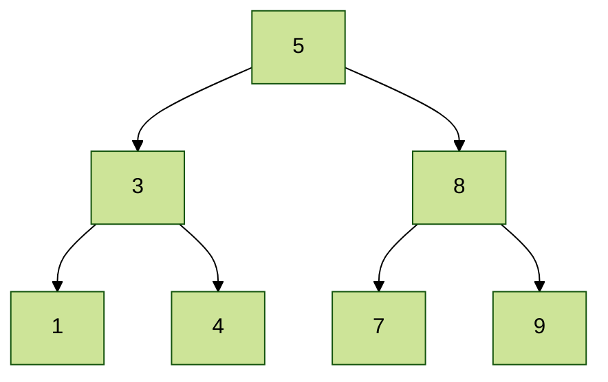
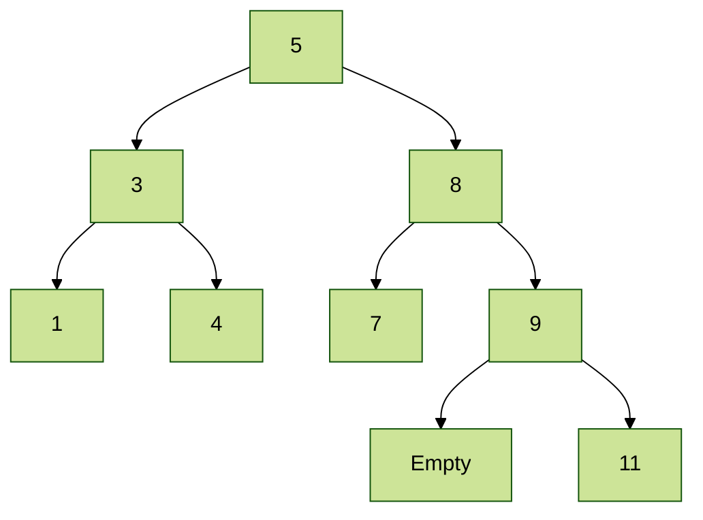



In this series, I will mainly cover user-defined types and type classes to show that we can also define our own types to fit our purpose. The programming language used in this series will be mainly Haskell, and Rust will be used in last parts.

Unfortunately, I cannot provide a Haskell crash course, but [here](https://www.haskell.org/tutorial/intro.html) is a gentle introduction.

# Types

## Review of Basic Types in Haskell

These are some available types in Haskell.

- Base Type: `Integer`, `Bool`, and `Char`
- Function Type: `Argument Type -> Value Type`, such as `Int -> Int`
- List Type: `[Element Type]`, such as `[Char]`. Note that all elements in a list must have the same type.
- Tuple Type: `(elem1, elem2, ...)`. Note that elements of a tuple can have different types.

Type Declaration can be done by `name::Type`, such as

```haskell
add:: Int -> Int
add a = a+2
```

or even `2+(3::Float)`.

## Curried Function

A several-argument function actually takes one argument and returns another function taking the remaining arguments. For example, 

```haskell
ghci> :t (&&)
(&&) :: Bool -> Bool -> Bool
ghci> a = True        
ghci> take_second_arg = (&&) a
ghci> :t take_second_arg 
take_second_arg :: Bool -> Bool
ghci> take_second_arg False
False
ghci> take_second_arg True 
True
```

It seems that `&&` takes two arguments; however, it takes one by one. When it takes the first `Bool`, it returns a function of `Bool -> Bool`, which is a function to take another argument.

## Polymorphic Types

When the data type does not matter, a **type variable** can be used instead of a specific type. Remember this term.

```haskell
ghci> :t (++)
(++) :: [a] -> [a] -> [a]
ghci> (++) [1,2] [3,4]
[1,2,3,4]
ghci> (++) ['a','b'] ['c','d','e']
"abcde"
ghci> (++) [True, False] [False, True]
[True,False,False,True]
ghci> (++) [1,2] ['a','b']

<interactive>:23:7: error:
    * No instance for (Num Char) arising from the literal `1'
    * In the expression: 1
      In the first argument of `(++)', namely `[1, 2]'
      In the expression: (++) [1, 2] ['a', 'b']
```

In this example, a list concatenation does not care the type of list elements. So, it can use `[a]` instead of `[Int]`, and `[Bool]`; however, it cares that both lists must have the same type, so the function type of `++` is `[a]->[a]->[a]`.

## Type Synonym

You can define a synonym for a type with the `type` declaration. For example, `type String = [Char]`. Names of Types must start with an upper case letter.

## User-Defined Types

We can define a new type by providing their values. For example, `data Color = Red | Green | Blue`. `Color` is a new type with the three values consisting of `Red`, `Green`, and `Blue`.

We can also make a new type from existing types by attaching them with a constructor.

```haskell
data Shape = Circle Float | Rectangle Float Float
```

Shapes are either one `Float` attached to the constructor `Circle`, or two `Float` attached to the constructor `Rectangle`.

Some possible values of this `Shape` type are

- `Circle 3.0`
- `Rectangle 3.0 4.0`

Please note that names of types and values/constructors must start with an uppercase letter, like `Shape` and `Circle`.

## Constructor

Constructors can also be seen as functions taking some data and returning a value of the new type. In other words, constructors behave most ways as functions.

```haskell
ghci> data Shape = Circle Float | Rectangle Float Float
ghci> :t Rectangle
Rectangle :: Float -> Float -> Shape
```

You can see that `Rectangle` has a type of `Float -> Float -> Shape`.

This is how to use a pattern matching with the user-defined type.

```haskell
ghci> :{
ghci| area :: Shape -> Float
ghci| area (Circle x) = x*x*pi
ghci| area (Rectangle a b) = a*b
ghci| :}
ghci> area (Rectangle 3.0 4.0)
12.0
```

and

```haskell
ghci> :{
ghci| data Color = Red | Green | Blue
ghci| colorName::Color -> String
ghci| colorName Red = "Red"
ghci| colorName Green = "Green"
ghci| colorName Blue = "Blue"
ghci| :}
ghci> colorName Red        
"Red"
```

## Recursive Data Types

Your defined types can be recursive.

```haskell
data Expr = Constant Float 
          | Add Expr Expr
          | Multiply Expr Expr
          deriving (Show, Eq)

eval :: Expr -> Float
eval (Constant x) = x
eval (Add e1 e2) = eval e1 + eval e2
eval (Multiply e1 e2) = eval e1 * eval e2

ex = (Add (Constant 1.0) (Multiply (Constant 2.0) (Constant 3.0)))
```

The result of `eval ex` is `7.0`. The `ex` represents 1+(2x3).

## Parameterized Data Types

Types can be parameterized by the type variables.

```haskell
data Tree a = Empty | Node a (Tree a) (Tree a)  deriving Show
```
This is a binary tree data type.

- `Tree` is a type constructor.
- `Tree a` is a type.
  - `Tree String` is then a data type.
  - `Tree Int` is also a data type.
- `Node` is a data constructor.

This is how to use it.

```haskell
data Tree a = Empty | Node a (Tree a) (Tree a)  deriving Show

insert :: (Ord a) => a -> Tree a -> Tree a
insert v Empty  = Node v Empty Empty
insert v (Node x l r)   | v == x = Node x l r
                        | v < x = Node x (insert v l) r
                        | True  = Node x l (insert v r)
--  Define a hard-coded tree
myTree = Node 5 (Node 3 (Node 1 Empty Empty) (Node 4 Empty Empty)) (Node 8 (Node 7 Empty Empty) (Node 9 Empty Empty))
```

This is `myTree`.



After running `insert 11 myTree`, the result is `Node 5 (Node 3 (Node 1 Empty Empty) (Node 4 Empty Empty)) (Node 8 (Node 7 Empty Empty) (Node 9 Empty (Node 11 Empty Empty)))`



Until now, we have finished essential knowledge of the data types. For anyone that learns this thing for the first time, you will be confused for sure. Take a break and review them before continuing to the next part.

# Type Classes

## Background Story

Recall the term "type variables" and how it is used. Until now, all type variables can take **any type**.

```haskell
ghci> :t (++)
(++) :: [a] -> [a] -> [a]
ghci> :t map
map :: (a -> b) -> [a] -> [b]
```

There is no problem for `map` and `++` to take any type for the type variables `a` and `b`. However, let's think about a comparison function, such as `<`. Should the type variable accept any type?

Pause here to think about it.

We can say that `3<4` is correct, and `5<3` is incorrect easily since it makes sense (I hope you agree with me). Everyone passing the elementary math course agrees with them.

But imagine the rock-paper-scissor game, how should we evaluate `rock < scissor`? According to my experience, `rock` wins; however, does this mean `rock` is less than `scissor`? Debatable.

`<` should be used when two arguments can be inargurably comparable. However, if we currently use the polymorphic type with this function, it implies that you can assign not only `Int`, but also `rock-paper-scissor` as a type to this function `<`. This is an inappropriate situation that must be solved.

## Type Classes

Fortunately, Haskell has solved this problem.

```haskell
ghci> :t (<)
(<) :: Ord a => a -> a -> Bool
```

Can you see something new? Can you see `Ord a =>`? Yes, this is a solution!

`Ord a => a -> a` is a qualified type. The qualified type means a type including type class constraints. It is qualified because the type is restricted or qualified by certain conditions that must be satisfied.

`Ord a =>` means that the polymorphic type is restricted to belong to the **type class** `Ord`. `Ord` is Haskell's type class for ordering and comparison. It allows you to compare values to determine which is smaller, larger, or equal.

The form of a qualified type is `constraint => type`, and the type can be qualified by several type classes, such as `(Ord a, Show a) => ...`.

## Custom Classes

-- Under Construction --